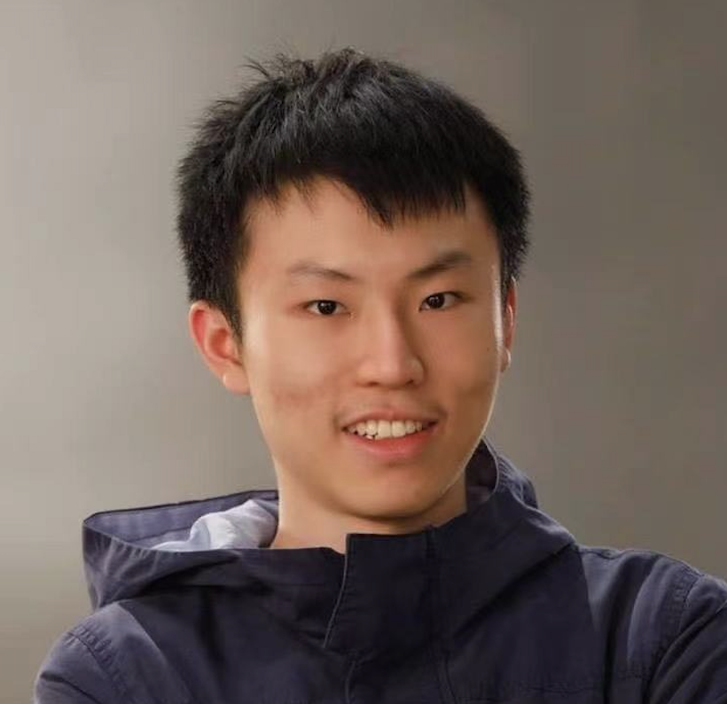

Hello and welcome to this blog. My name is Jixian Fan and you can find my email here Jixian.fan@uqconnect.edu.au

The purpose of this blog is simply to document my journey.

RESEARCH INTERESTS
Mechatronic, Electronic and Communication Engineering
EDUCATION
Master.Eng. in Australia, - University of Queensland
B.Eng. in Australia, – The Australia National University (fourth year honour) Western Australian Certification of education, – Aidi School
SOCIAL EXPERIENCE
• Practice Engineer, Alibaba Cloud Authorized Service Centre
§ Assisted in test and promote an online cloud service system
§ Participate in collecting and analysing user experience for cloud service
system
§ Participate in experience and give feedback for a cloud storage website
• Practice Engineer, Internship in State Grid Corporation of China, Henan
§ Work in Automatic generation control (AGC) and grid control
• Volunteer, Beijing children's language rehabilitation centre
HONORS / AWARDS
Sir Isaac Newton Exam Award, 2015,2016
The CENTRE for EDUCATION in MATHEMATICS and COMPUTING, University of WATERLOO, DISTINCTION in Hypatia Contest, 2015 and Euclid Contest, 2016
Australian National Chemistry Quiz, CERTIFICATE OF HIGH DISTINCTION, 2014
Australian National Chemistry Quiz, CERTIFICATE OF ClASS Excellence- 100%, 2016
    
LANGUAGES
Mandarin (native) English (oral and written)
## ELEC4630

Assignement3 [link to assignment3 code](https://www.fast.ai). 
